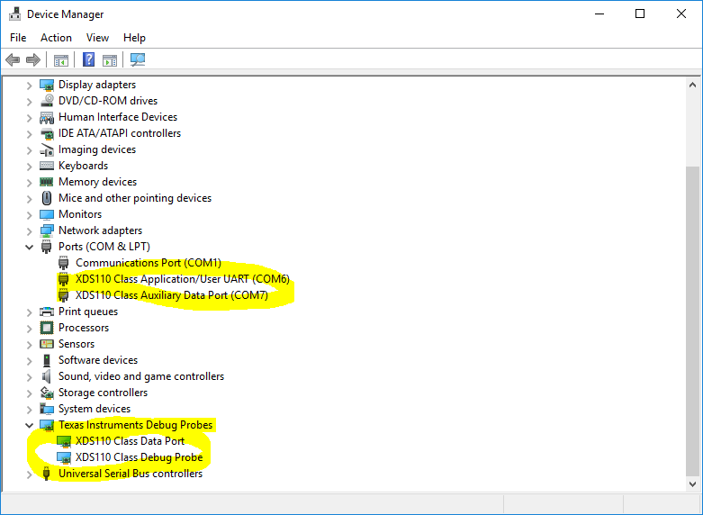

# SensorTagFirmware
Custom firmware images for the CC2650 based [TI SensorTag](http://www.ti.com/ww/en/wireless_connectivity/sensortag2015/)

The current SensorTagSuper.hex image is a customization of the SensorTag project found in the [TI BLE-STACK-2-1-1](http://www.ti.com/tool/ble-stack) that always advertises when not connected, and does so at a rate of 1s rather than the default of 100ms.

It is a SuperHex File as described in:
[CC2650 SensorTag User's Guide#Building_the_SensorTag_Firmware](http://processors.wiki.ti.com/index.php/CC2650_SensorTag_User's_Guide#Building_the_SensorTag_Firmware)

To flash this version of the firmware, you need the $15 [cc-devpack-debug](http://www.ti.com/tool/cc-devpack-debug) and the free [SmartRF Flash Programmer v2](http://www.ti.com/tool/flash-programmer).

In progress is a version of the firmware that can be loaded via the TI SensorTag apps for Android/iOS using the OAD feature.

# Restoring the factory firmware using SmartRF v2 Flash Programmer
If you find that you SensorTag is not advertising as expected after doing a firmware update, try to restore the factory image that comes with the BLE 2.1.1 stack uisng the SmartRF v2 Flash Programmer.

## Step 1: Download and install the following software from TI

* [TI BLE-STACK-2-1-1](http://www.ti.com/tool/ble-stack)
* [SmartRF Flash Programmer v2](http://www.ti.com/tool/flash-programmer)

You need a free myTI development account to be able to agree to the download terms.

## Step 2: Connect the SensorTag to Windows using the CC-Debugger
Connect the CC-Debugger USB cable to the Windows host and verify it is seen by opening up the Windows Device Manager. You can do this by starting to type the phrase "device manager" in the windows search field. This should locate the Device Manager control panel item as shown here:



Launch the Device Manager, and you should find the CC-Debugger showing up as and XDS110 device under the Ports and Texas Instruments Debug Probes sections:



## Step 3: Launch the Flash Programmer 2
Launch the SmartRF v2 flash programmer by clicking the Flash Programmer 2 link on the desktop, or by finding the Flash Programmer 2 entry under the Texas Instruments folder in the all apps section of the start menu. On startup it should scan for connected devices and find the SensorTag under the XDS110 entry as a CC2650 target as shown here:



If the scan fails, try unplugging the CC-Debugger from USB port, and then plug it back in.

## Step 4: Select the image to flash
Under the Flash image(s) section, click the Single radio button, and then browse to locate the C:/ti/simplelink/ble_cc26xx_2_01_01_44627/Accessories/HexFiles/CC2640_SensorTag.hex image that was installed as part of the BLE 2.1.1 stack installation.

Under the Actions section, click to Erase all unprotected pages, click to Program entire source file, and click to verify with CRC check.

## Step 5: flash the image

Click the run button found under the Verify section to begin flashing the image to the SensorTag. The complete output in the Status window and app interface should look similar to the following if the flash was successful:

	>Initiate access to target: XDS-L3002770.
	>Reading file: C:/ti/simplelink/ble_cc26xx_2_01_01_44627/Accessories/HexFiles/CC2640_SensorTag.hex.
	>Start flash erase ...
	>Erase finished successfully.
	>Start flash programming ...
	>Programming finished successfully.
	>Start flash verify ...
	>Skip verification of unassigned page: 12.
	>Skip verification of unassigned page: 13.
	>Skip verification of unassigned page: 14.
	>Skip verification of unassigned page: 15.
	>Page: 0 verified OK.
	>Page: 1 verified OK.
	>Page: 2 verified OK.
	>Page: 3 verified OK.
	>Page: 4 verified OK.
	>Page: 5 verified OK.
	>Page: 6 verified OK.
	>Page: 7 verified OK.
	>Page: 8 verified OK.
	>Page: 9 verified OK.
	>Page: 10 verified OK.
	>Page: 11 verified OK.
	>Page: 16 verified OK.
	>Page: 17 verified OK.
	>Page: 18 verified OK.
	>Page: 19 verified OK.
	>Page: 20 verified OK.
	>Page: 21 verified OK.
	>Page: 22 verified OK.
	>Page: 23 verified OK.
	>Page: 24 verified OK.
	>Page: 25 verified OK.
	>Page: 26 verified OK.
	>Page: 27 verified OK.
	>Page: 28 verified OK.
	>Page: 29 verified OK.
	>Page: 30 verified OK.
	>Page: 31 verified OK.
	>Verification finished successfully.
	>Reset target ...
	>Reset of target successfull.




At this point the SensorTag should have been reset and will start advertising for 30 seconds. If it does not, try detaching the debugger and hitting the power button on the SensorTag.

